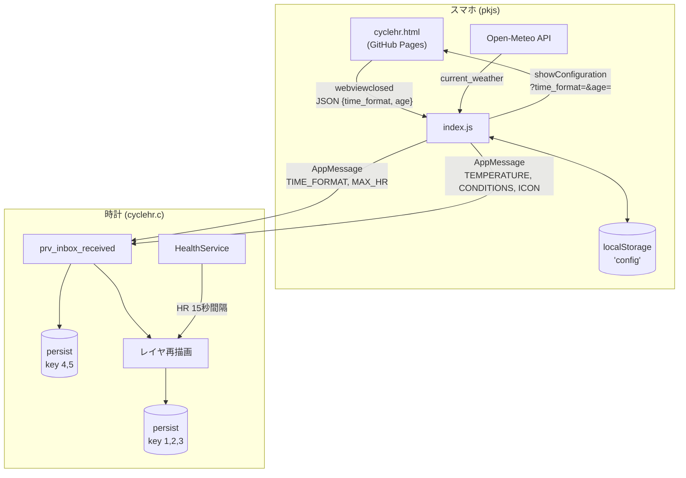

# CycleHR 設計書

サイクリング用 Pebble ウォッチフェイス。直近 60 分の心拍を 1 分刻みで記録し、
心拍ゾーン別に色分けした棒グラフで表示する。

- 対象: diorite (Pebble 2 HR, 144×168 モノクロ) / emery (Pebble Time 2, 200×228 カラー)
- SDK: Pebble SDK 4.17 (`sdkVersion: "3"`)
- UUID: `7c3f2a4e-9b1d-4e6a-8f5c-2d7e91a3b6c4`

---

## 1. リポジトリ構成とブランチ戦略

このリポジトリは複数の Pebble プロジェクトを 1 つに束ねている。CycleHR は
`cyclehr/` サブディレクトリに置く。

```
ubiquitous-space-broccoli/
├── cyclehr/                 ← 本プロジェクト
│   ├── package.json         appinfo 相当（UUID / 対応機種 / フォント定義 / messageKeys）
│   ├── wscript              waf ビルド定義（GCC 警告抑止を追加済み）
│   ├── DESIGN.md            本ドキュメント
│   ├── README.md            使い方とビルド手順
│   ├── resources/fonts/     Orbitron Bold / Saira SemiCondensed Medium
│   └── src/
│       ├── c/cyclehr.c      ウォッチフェイス本体（単一ファイル）
│       └── pkjs/index.js    スマホ側 JS（天気取得・設定画面の橋渡し）
├── cyclehr.html             設定画面（GitHub Pages で配信）
└── (他プロジェクト: NNEWS, pebblequest, apngwatch, ...)
```

### ブランチ

| ブランチ | 役割 |
| --- | --- |
| `codespace-ubiquitous-space-broccoli-5g4qwwv67qq2vjqr` | デフォルトブランチ。**GitHub Pages の配信元** |
| `cyclehr-cloudpebble` | CloudPebble 同期用ミラー。プロジェクトをリポジトリ**ルート**に展開したもの |
| `claude/continue-work-design-7prnwp` | 本作業ブランチ |

**なぜ 2 つのレイアウトがあるか**: CloudPebble（Web IDE）は GitHub 連携時に
プロジェクトがリポジトリルートにあることを要求する。そのため `cyclehr-cloudpebble`
では `40b0b2c` で他プロジェクトを削除し CycleHR をルートへ移動している。

**今後の方針**: デスクトップにローカル SDK を入れるとサブディレクトリ構成
（`cd cyclehr && pebble build`）で問題なくビルドできる。よって
**`cyclehr/` サブディレクトリ構成を正**とし、CloudPebble を使いたい場合のみ
ミラーブランチを再生成する（手順は §8.4）。

### GitHub Pages の依存関係

`src/pkjs/index.js` の `CONFIG_URL` は
`https://pikaring.github.io/ubiquitous-space-broccoli/cyclehr.html` を指す。
Pages は**デフォルトブランチ**から配信されるため、`cyclehr.html` を変更したら
デフォルトブランチにマージするまで実機の設定画面には反映されない。
現行の `cyclehr.html`（`time_format` / `age`）は `index.js` の期待する契約と
一致しているので、本ブランチでは変更していない。

---

## 2. 画面設計

### 2.1 構造

上から 6 段。段の境界のうち 3 本（天気 / 時刻 / 心拍の下端）に白い区切り線を引く。

```
┌────────────────────────────────┐
│ ☀  21°C              SUNNY     │  weather   （アイコン / 気温 / 天候）
├────────────────────────────────┤
│                                │
│  14:23                  PM     │  time      （Orbitron 大 + AM/PM + 日付）
│                     WED 12     │
├────────────────────────────────┤
│ HEART RATE                     │
│  ((♥))            142  bpm     │  hr        （ハート + 現在心拍）
├────────────────────────────────┤
│        1-MIN HR ZONES          │  label
│    ▁▂▃▅▇▆▅▃▂▁▂▃▅▇▆▅▃▂          │  chart     （60 本の棒 + 時間軸）
│ 60m ago      30m         Now   │
│ [Z1][Z2][Z3][Z4][Z5]           │  legend
└────────────────────────────────┘
```

### 2.2 縦方向の領域配分

画面高 `h` に対する比率で決め、チャートだけ残り全部を取る（端数を吸収する）。

| 領域 | 計算式 | emery (h=228) | diorite (h=168) |
| --- | --- | ---: | ---: |
| weather | `h * 13 / 100` | 29 | 21 |
| time | `h * 27 / 100` | 61 | 45 |
| hr | `h * 25 / 100` | 57 | 42 |
| label | 固定 | 14 | 14 |
| chart | 残り | 53 | 32 |
| legend | 固定 | 14 | 14 |
| **合計** | | **228** | **168** |

`big = (h >= 200)` で emery / diorite を判別し、フォントと細部の寸法を切り替える。

右カラム（AM/PM + 日付）の x 座標は機種で分ける。emery では画面幅の 55%
（=110px）から開始する。Orbitron の時刻は左揃えでそこまで届かないため、
`WED 12` のような長い曜日名が切れないように幅を広く取れる。
diorite では `w - right_w + 2`（=103px）。

### 2.3 フォント

`package.json` の `resources.media` で TTF から複数サイズを焼き込む。
`characterRegex` で必要な文字だけに絞り、リソースサイズを節約している
（全機種合計 23,848 bytes / 256KB）。

| 用途 | フォント | emery | diorite | characterRegex |
| --- | --- | --- | --- | --- |
| 時刻 | Orbitron Bold | 40 | 28 | `[0-9\-:]` |
| 心拍数値 | Orbitron Bold | 36 | 24 | `[0-9\-:]` |
| 気温 / 天候 / AM・PM / 日付 | Saira SemiCondensed Medium | 18 | 12 | `[ -~°]` |
| `bpm` | Saira SemiCondensed Medium | 24 | 12 | `[ -~°]` |
| 小ラベル（`HEART RATE` / `1-MIN HR ZONES` / 軸 / 凡例） | Saira SemiCondensed Medium | 14 | 12 | `[ -~°]` |

diorite は幅 144px しかないため、`07ae3db` で全ラベルを 12pt に統一して
クリッピングを解消している。

### 2.4 配色

背景は黒固定。文字と区切り線は白。

| ゾーン | 範囲（最大心拍比） | emery (カラー) | diorite (モノクロ) |
| --- | --- | --- | --- |
| Z1 | < 60% | `GColorLightGray` | 白 |
| Z2 | 60–70% | `GColorBlueMoon` | 白 |
| Z3 | 70–80% | `GColorGreen` | 白 |
| Z4 | 80–90% | `GColorYellow` | 白 |
| Z5 | ≥ 90% | `GColorRed` | 白 |

`prv_zone_color()` は `PBL_COLOR` の有無で分岐する。diorite ではゾーン色が
潰れるため、棒の**高さ**だけが情報になる。

### 2.5 ハートアイコンの拍動

`prv_heart_update_proc()` は円 2 つ + 三角形でハートを描き、その左右に
`(( ))` 状の円弧を 2 重に描く。外側の弧（太さ 2）は常時表示、内側の弧
（太さ 1）は `SECOND_UNIT` ティックごとに `s_blink` を反転させて点滅させる。

---

## 3. データフロー



### 3.1 設定

1. ユーザーが Pebble アプリの歯車アイコンをタップ → `showConfiguration`
2. `index.js` が `localStorage` の現在値をクエリパラメータに載せて
   `Pebble.openURL(CONFIG_URL + '?time_format=…&age=…')`
3. 設定画面で「保存」→ `pebblejs://close#<JSON>` へ遷移
4. `webviewclosed` で JSON を受け取り `localStorage` に保存し、時計へ送信
5. 送信時に **`MAX_HR = 220 - age` を JS 側で計算**する。時計は年齢を知らない
6. 時計は範囲チェック（`100 ≤ MAX_HR ≤ 230`、`0 ≤ TIME_FORMAT ≤ 2`）の上で
   `persist` に保存し、時刻・チャート・凡例を再描画

`ready` イベントでも `sendConfig(getConfig())` を呼ぶので、アプリ起動のたびに
スマホ側の設定が時計へ再送される。スマホが無い状態でも時計は `persist` の値で
動作する。

**設定の正はスマホの `localStorage`**。アプリを入れ直すと `localStorage` が
消え、設定画面はデフォルト（`age=35`）に戻る。時計側は前の値を保持したままなので、
その場合は一度設定を保存し直す必要がある。

### 3.2 天気

Open-Meteo（APIキー不要）を使う。`navigator.geolocation` で現在地を取得し、
`current_weather=true` で気温と WMO 天気コードを得る。コードは `describe()` で
ラベル（`SUNNY` / `RAIN` / …）とアイコン ID（0–5）に写像する。

`ready` で 1 回、その後 `setInterval` で 30 分ごとに更新。
pkjs はウォッチフェイス表示中のみ動く点に注意。

天気キーが 1 つも含まれないメッセージ（＝設定のみの送信）では `s_weather_valid`
を立てない。立ててしまうと、初回の天気取得が終わる前に既定値の太陽アイコンが
`--°C` の横に出てしまう。

### 3.3 心拍

- `health_service_set_heart_rate_sample_period(15)` でセンサーを 15 秒間隔に
- `health_service_events_subscribe()` の**全イベント**で再読み込みする。
  `HealthEventHeartRateUpdate` は新しいファームウェアでしか飛ばないため、
  movement / significant イベントも拾う（`7ee40ab`）
- 表示値: 取得できたら数値、センサーはあるが未取得なら `--`、
  センサー自体が使えなければ `---`
- 履歴への記録は `MINUTE_UNIT` ティックのみ。**その瞬間の値**を 1 分の代表値と
  して 1 サンプル書き込む（分間平均ではない）

---

## 4. 永続化

| キー | 定数 | 型 | 内容 |
| ---: | --- | --- | --- |
| 1 | `PERSIST_KEY_HISTORY` | `uint8_t[60]` | 心拍履歴（リングバッファ）。0 = データなし |
| 2 | `PERSIST_KEY_HEAD` | int | 次の書き込み位置 |
| 3 | `PERSIST_KEY_SAVED_AT` | int | 最後に保存した UNIX 時刻 |
| 4 | `PERSIST_KEY_MAX_HR` | int | 最大心拍数（100–230） |
| 5 | `PERSIST_KEY_TIME_FORMAT` | int | 0=本体設定 / 1=12h / 2=24h |

履歴は `s_head` を次の書き込み位置とするリングバッファ。最古が `s_history[s_head]`、
最新が `s_history[s_head-1]`。

復元時（`prv_load_history`）は、保存時刻からの経過分を計算して:

- 60 分以上経過 → 全消去
- 60 分未満 → 経過分だけ 0（データなし）を書き込んでヘッドを進める

これにより、ウォッチフェイスを離れていた時間帯がグラフ上で空白になる。

---

## 5. AppMessage キー

`package.json` の `messageKeys` で定義。すべてスマホ → 時計の一方向で、
時計からの送信は無い（`app_message_open(128, 32)`）。

| キー | 型 | 範囲 / 例 |
| --- | --- | --- |
| `TEMPERATURE` | int32 | 摂氏、四捨五入済み |
| `CONDITIONS` | string | `SUNNY` / `P.CLOUDY` / `CLOUDY` / `FOG` / `RAIN` / `SHOWERS` / `SNOW` / `THUNDER` / `---` |
| `ICON` | int32 | 0=SUN, 1=PART_CLOUD, 2=CLOUD, 3=RAIN, 4=SNOW, 5=THUNDER |
| `TIME_FORMAT` | int32 | 0=本体設定 / 1=12h / 2=24h |
| `MAX_HR` | int32 | 100–230 |

アイコン ID の定義は `src/c/cyclehr.c` の `enum` と `src/pkjs/index.js` の
`ICON_*` 定数で**二重管理**になっている。片方だけ変えないこと。

---

## 6. 心拍ゾーンとチャートのスケール

ゾーン境界はコンパイル時定数ではなく、`s_max_hr` から実行時に計算する。

```c
#define ZONE2_MIN (s_max_hr * 60 / 100)
#define ZONE3_MIN (s_max_hr * 70 / 100)
#define ZONE4_MIN (s_max_hr * 80 / 100)
#define ZONE5_MIN (s_max_hr * 90 / 100)
```

チャートの縦軸は `CHART_HR_MIN`（50 bpm 固定）から `s_max_hr` まで。

```c
hgt = (hr - 50) * chart_h / (s_max_hr - 50)
```

50 bpm 未満は下限（2px）に丸める。50 bpm は「表示の床」であって Z1 の下限
ではない点に注意（設定画面は Z1 の下限を最大心拍の 50% として表示する）。

横軸は 60 本固定。棒 1 本の幅は `w/60`、間に 1px の隙間を空ける。
emery のチャート幅は 196px なので 1 本あたり約 3px、diorite は 140px で約 2px。

---

## 7. ビルドとデプロイ

### 7.1 ツールチェイン

検証済みの組み合わせ:

| | バージョン |
| --- | --- |
| Pebble Tool | 5.0.39 |
| Pebble SDK | 4.17 |
| arm-none-eabi-gcc | 14.2.1 (SDK 同梱) |
| Python | 3.11 |

### 7.2 デスクトップでのセットアップ

```sh
# 1) uv と pebble-tool
curl -LsSf https://astral.sh/uv/install.sh | sh
export PATH="$HOME/.local/bin:$PATH"     # 必要なら .zshrc / .bashrc へ
uv tool install pebble-tool
pebble sdk install latest                # -> SDK 4.17

# 2) エミュレータを使う場合のみ SDL2 ランタイム
sudo apt install -y libsdl2-2.0-0        # Debian / Ubuntu
brew install sdl2                        # macOS

# 3) ビルド
cd cyclehr
pebble build                             # -> build/cyclehr.pbw
```

Windows は WSL2 上の Ubuntu で上記と同じ手順。

### 7.3 実行

```sh
pebble install --emulator emery      # エミュレータ（カラー 200x228）
pebble install --emulator diorite    # エミュレータ（モノクロ 144x168）
pebble install --phone <スマホのIP>   # 実機（Pebble アプリの開発者接続を ON）
pebble logs --phone <スマホのIP>      # console.log / APP_LOG を見る
pebble kill                          # エミュレータ終了
```

エミュレータには心拍センサーが無いのでグラフは空のまま。ゾーン色とチャートの
確認には diorite / emery の実機が要る。天気はスマホの位置情報を使うため、
エミュレータでは `pebble emu-set-location` を併用する。

### 7.4 CloudPebble ミラーの再生成

CloudPebble で編集したい場合のみ。`cyclehr/` の中身をルートに展開した
ツリーを `cyclehr-cloudpebble` に push する。

```sh
git checkout --orphan tmp-cp
git rm -rq --cached .
git archive HEAD cyclehr | tar -x --strip-components=1
git add -A && git commit -m "CloudPebble sync"
git push -f origin tmp-cp:cyclehr-cloudpebble
git checkout - && git branch -D tmp-cp
```

`src/c/cyclehr.c` 冒頭の `#ifndef time_t` ガードは、この 2 環境の差を吸収する
ためのもの（§7.5）。

### 7.5 トリッキーな箇所

いずれも過去のビルド失敗への対処。消さないこと。

1. **`#ifndef time_t` / `#include <sys/types.h>`** (`fa8cca4`)
   SDK は `-D_TIME_H_` 付きでビルドするため `<time.h>` が無効化される。
   ローカルツールチェインでは `time_t` が未定義になるので `<sys/types.h>` から
   取り込む。一方 CloudPebble は `-Dtime_t=long` を渡すので、そこで
   `<sys/types.h>` を include すると型が二重定義になって失敗する。
   よって「`time_t` がマクロとして未定義のときだけ include」する。

2. **`wscript` の `-Wno-builtin-macro-redefined` / `-Wno-builtin-declaration-mismatch`** (`4d1fbe4`)
   SDK 4.x は GCC 4 系向けに書かれており、GCC 9+ が SDK 自身のフラグと
   ヘッダに対して警告を出す。`-Werror` 相当で落ちるのを防ぐ。

3. **`__attribute__((fallthrough))`** — 天気アイコンの switch で
   `ICON_PART_CLOUD` から意図的に落とすため。

4. **リンカの `LOAD segment with RWX permissions` 警告** — SDK のリンカ
   スクリプト由来。無害なので無視してよい。

### 7.6 メモリ実績

| | emery | diorite |
| --- | ---: | ---: |
| リソース | 23,848 / 262,144 B | 23,848 / 262,144 B |
| RAM フットプリント | 6,171 / 131,072 B | 6,011 / 65,536 B |
| 空きヒープ | 124,901 B | 59,525 B |

フォントを増やすとリソースと RAM の両方が増える。`characterRegex` を
広げるときは実測すること。

---

## 8. 検証状況

- ✅ `pebble build` が diorite / emery ともに警告なしで通ることを確認
  （SDK 4.17 / Pebble Tool 5.0.39、`build/cyclehr.pbw` 生成まで）
- ❌ エミュレータでの描画確認は**未実施**。開発コンテナ内で QEMU は起動する
  ものの pypkjs のブリッジがポートを bind できず `[Errno 111] Connection refused`
  になる。デスクトップ（`libsdl2` 導入済み）では動くはずなので、
  レイアウトの目視確認はそちらで行う
- ❌ 実機（diorite / emery）での心拍取得は未検証

---

## 9. 既知の課題・今後の作業

優先度順。

1. **エミュレータ / 実機でのレイアウト目視確認**
   特に diorite（144×168）は余白が少ない。`WED 12` / 3 桁心拍 / `SUNNY` などの
   最長ケースで文字が切れないかを確認する。

2. **`SECOND_UNIT` 購読によるバッテリー消費**
   ハートの内側の弧を点滅させるために毎秒ティックを受けている。ロングライド
   向けのフェイスとしては割に合わない可能性がある。選択肢:
   - 心拍が取得できているときだけ点滅させる
   - 点滅を設定項目にする
   - `MINUTE_UNIT` のみにして点滅を諦める

3. **最大心拍数の直接入力**
   現在は `220 - 年齢` のみ。実測値を知っているユーザー向けに、設定画面へ
   直接入力欄を足す。`cyclehr.html` と `sendConfig()` の両方の変更が必要で、
   Pages 反映のためデフォルトブランチへのマージも要る。

4. **1 分値が瞬時値であること**
   `prv_record_sample()` はティック時点の値をそのまま保存する。15 秒間隔の
   サンプルを分内で平均すればグラフが滑らかになる。

5. **華氏対応** — 気温は摂氏固定。

6. **basalt（Pebble Time）の扱い**
   `7ee40ab` で `targetPlatforms` から外した（心拍センサー非搭載のため）。
   時刻と天気だけのフェイスとして復活させるかは要判断。

7. **アイコン ID の二重管理**
   `cyclehr.c` の `enum` と `index.js` の定数。片方だけ変えると壊れる。
